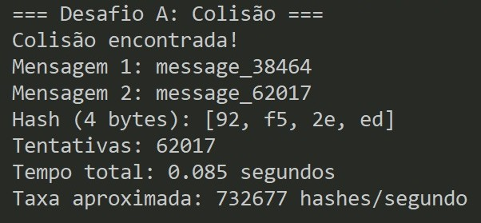
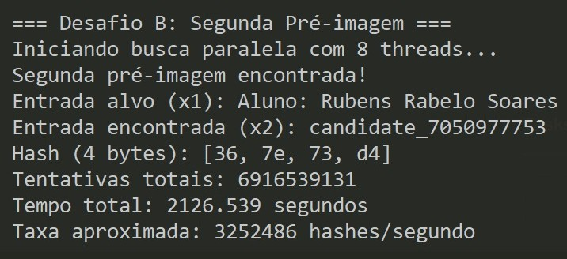

# **Trabalho Extra de Criptografia**

**Nome:** Rubens Rabelo Soares


## **1. Pré-requisitos**

Para compilar e executar o projeto, é necessário possuir:

* **Rust** (toolchain oficial, incluindo `cargo`)


## **2. Estrutura do Projeto**

O projeto foi organizado de forma **modular**, seguindo boas práticas da linguagem Rust e facilitando a manutenção, leitura e análise de cada desafio de forma independente.

```bash
src/
├── main.rs
└── lab/
    ├── mod.rs
    ├── desafio_a/
    │   ├── mod.rs
    │   └── collision.rs
    ├── desafio_b/
    │   ├── mod.rs
    │   └── second_preimage.rs
    └── desafio_c/
        ├── mod.rs
        └── preimage.rs
```

Cada desafio está isolado em seu próprio módulo, permitindo avaliar separadamente as técnicas utilizadas para quebrar cada propriedade criptográfica.


## **3. Como Executar o Programa**

Com o Rust devidamente instalado, execute o comando abaixo para compilar o projeto em modo otimizado:

```bash
cargo build --release
```

O programa é controlado via **linha de comando**, permitindo selecionar diretamente qual desafio será executado.

### **Compilação e execução otimizada**

```bash
cargo run --release a
cargo run --release b
cargo run --release c
```

Onde:

* `a` → Desafio A (Colisão)
* `b` → Desafio B (Segunda Pré-imagem)
* `c` → Desafio C (Pré-imagem)


## **4. Desafio A – Quebra da Resistência a Colisões**

### **Metodologia**

* Geração sequencial de mensagens (`message_n`)
* Cálculo do hash SHAKE128 com saída truncada
* Armazenamento dos hashes em uma estrutura de dados (`HashMap`)
* Detecção de colisão quando um hash já existente é encontrado

### **Análise**

Devido ao **paradoxo do aniversário**, espera-se encontrar colisões após aproximadamente:

$$
2^{n/2} \Rightarrow 2^{16} \approx 65,536
$$

tentativas, o que torna esse ataque rápido e computacionalmente viável mesmo em máquinas comuns.

*Os resultados obtidos estão apresentados nas imagens anexadas.*

<p align="center">
  
</p>


## **5. Desafio B – Quebra da Resistência à Segunda Pré-imagem**

### **Metodologia**

* Escolha da entrada fixa: `"Aluno: Rubens Rabelo Soares"`
* Cálculo prévio do hash da entrada alvo
* Busca por força bruta de uma segunda entrada distinta
* Utilização de múltiplas threads para paralelizar o ataque
* Uso de variáveis atômicas para controle seguro das tentativas
* Encerramento coordenado das threads ao encontrar uma solução válida

### **Análise**

A resistência à segunda pré-imagem exige, em média:

$$
2^n \Rightarrow 2^{32} \approx 4 \text{ bilhões}
$$

tentativas. Isso explica o tempo significativamente maior em comparação ao Desafio A, mesmo utilizando paralelismo.

*Os resultados obtidos estão apresentados nas imagens anexadas.*

<p align="center">
  
</p>


## **6. Desafio C – Quebra da Resistência à Pré-imagem**

### **Metodologia**

* Escolha do Hash alvo utilizado: `79455269`
* Geração sequencial de senhas candidatas (`password_n`)
* Cálculo do SHAKE128 com saída de 5 bytes
* Comparação parcial dos **34 bits** exigidos
* Execução paralela para acelerar a busca

### **Análise**

A resistência à pré-imagem é a propriedade mais forte entre as três e exige, em média:

$$
2^{34} \approx 17 \text{ bilhões}
$$

tentativas no pior caso. Mesmo com paralelismo, o ataque é computacionalmente caro, evidenciando como o aumento do tamanho do digest impacta diretamente na segurança do sistema.

*Os resultados obtidos estão apresentados nas imagens anexadas.*

<p align="center">
  
</p>


## **7. Dificuldades Encontradas**

* Alto tempo de execução nos desafios B e C
* Necessidade de paralelização para tornar os ataques viáveis
* Gerenciamento correto de threads e variáveis atômicas
* Compreensão prática das diferenças entre colisão, pré-imagem e segunda pré-imagem

